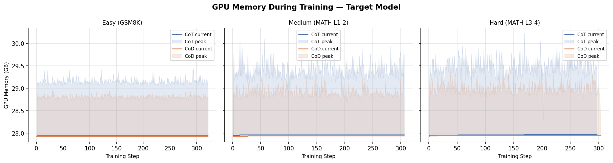
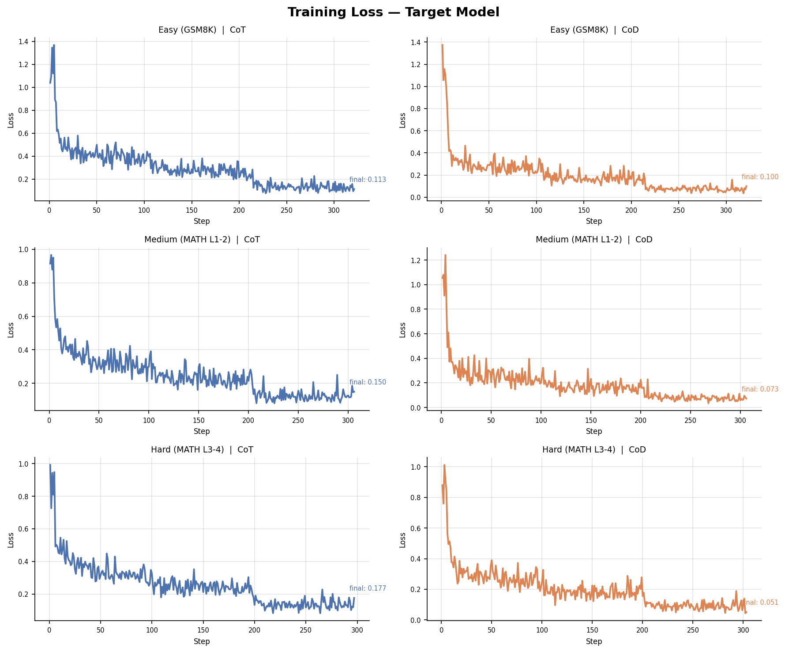
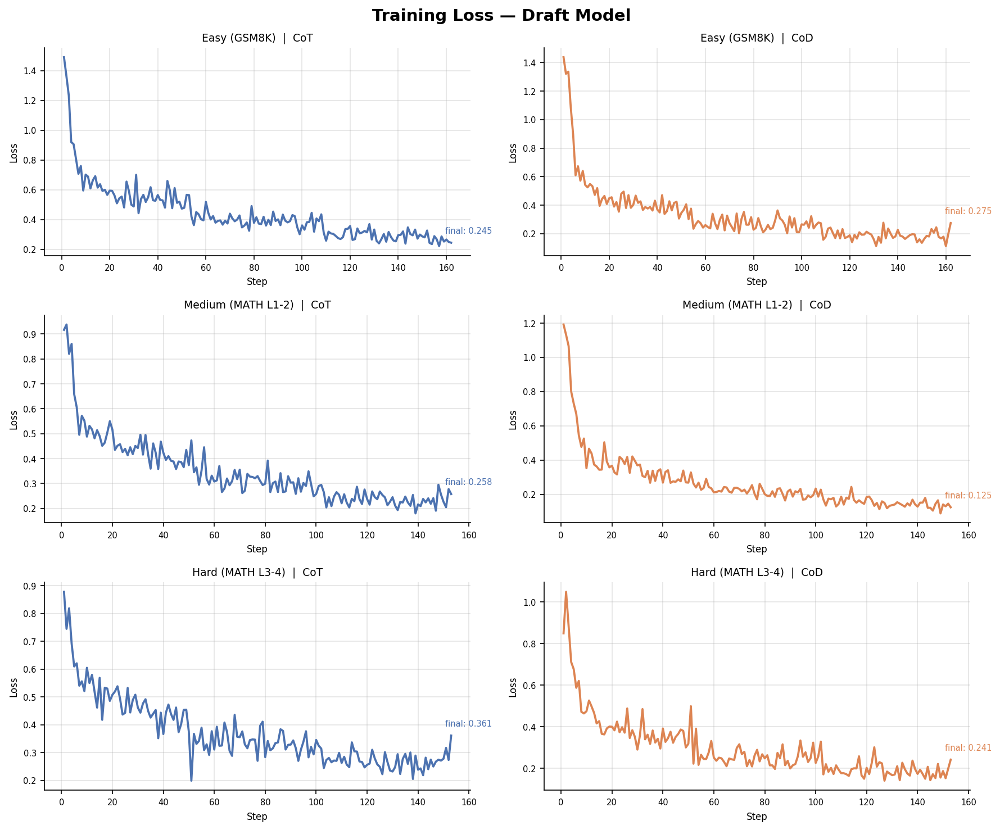
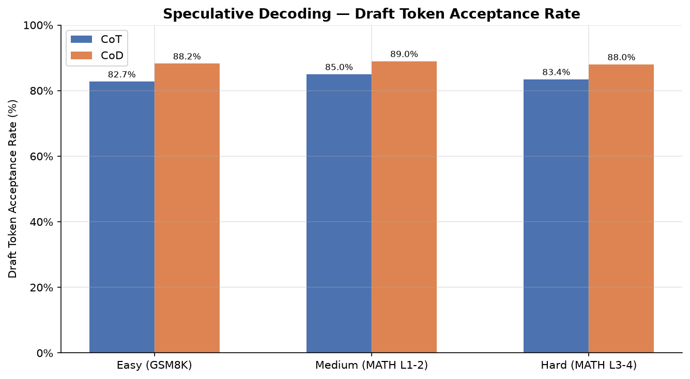
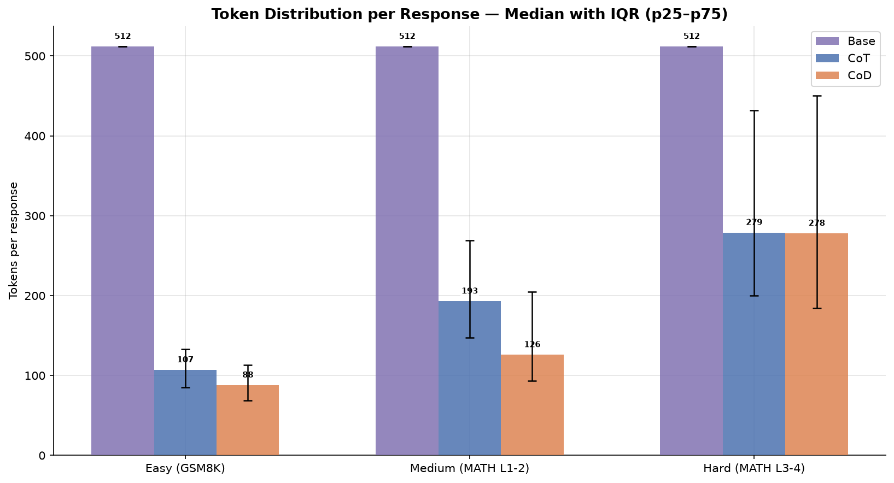
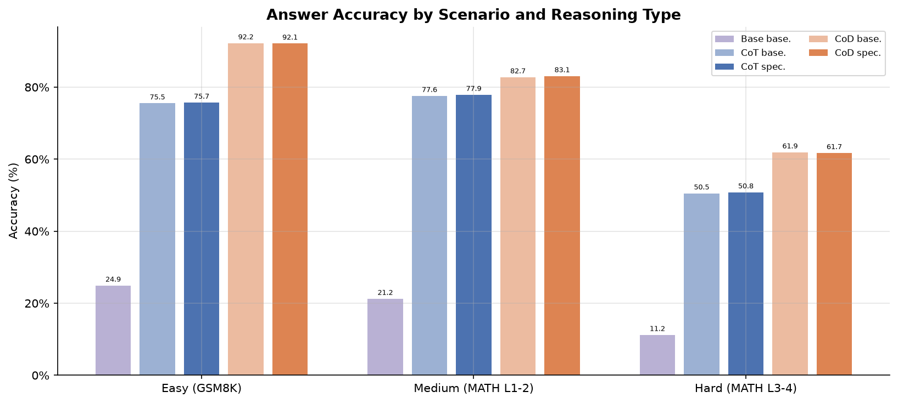
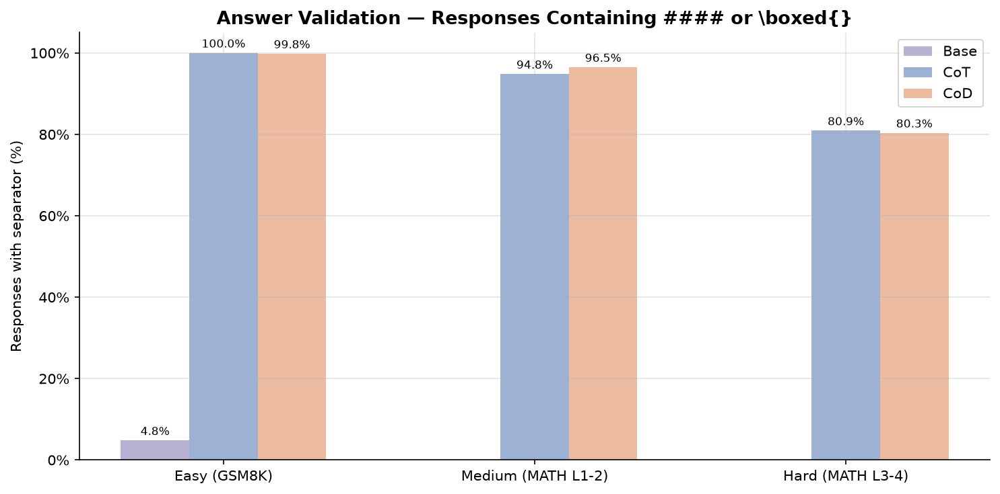
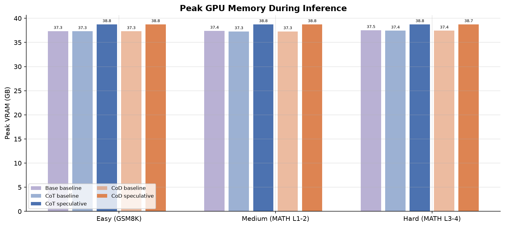
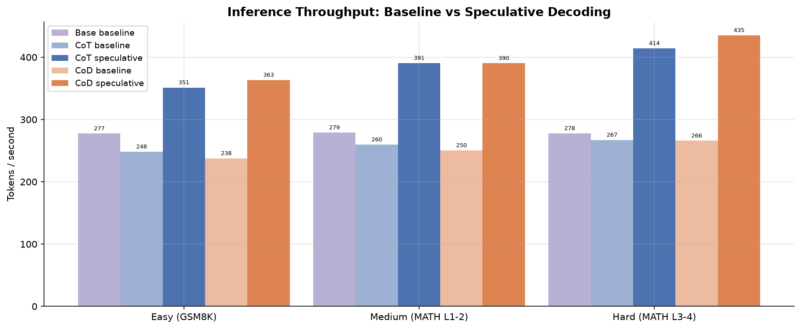

# Model Training and Evaluation

Welcome to the third and final post of the chain of draft speculative decoding series. The other parts of the blog can be found here

1. [Part 1: Introduction](/spec_decode_1)
2. [Part 2: Dataset Generation and Evaluation](/spec_decode_2)


The post will have the following structure
 
0. Introduction
1. Training the Target Model
2. Generating Distilled Data
3. Training the draft model
4. Evaluation 
5. Conclusion

## Introduction

In this section I'll talk about the training part and the evaluation, mainly what was used and why in comparison to other methods. But first

**Environment setup**

The GPU used in this experiment was an A40 (40GB VRAM), the models selected were Qwen3-14B for target and Qwen3-0.6B for draft. Nevertheless this is a model agnostic method, and the model can be adjusted as is suitable for your case. 

Note: I'm aware the previous parts mention Qwen2.5-14B for target, and Qwen2.5-0.5B for draft, I decided to change to a more recent model, nevertheless, the code and experiments are model agnostic. Feel free to use what is comfortable/best for your case.

Regarding libraries the specific versions used can be found in the `requirements.txt` file.

To set up the environment we use UV, a python package manager that is a bit faster than most. It's fine if you don't have it just simply run the script

```bash
bash scripts/uv_setup_env.sh
```

This will detect if uv package manager is installed in your system or not, then it will install the dependenciesinto a virtual environment called env. 

**General Process**

Our process is not that complicated. We first train the target models using the datasets generated in our previous post [^1]. After fine tuning the model we generate a distilled dataset using our target model. We then fine-tune our draft model on the distilled dataset before finally running our tests and evaluations.

You might ask why would we train the draft models on the distilled datasets instead of the original datasets that were used to train the target model, the reason is for the draft model we mostly care about alignment. If we train it on the original dataset it might develop a different thinking process than the target model, causing the target model to reject its output and slowing down our speculative decoding.

So remember that for speculative decoding, we care about our target model being correct, and our draft model thinking like our target model, even if that makes it less accurate than if it was trained on the original dataset. Alignment is key here.

## Training the Target Model

Our method of improving speculative decoding is unique in the sense that previous research (at the time of writing) focuses more on the draft model itself, whereas our experiments hypothesize that an "easier to understand" target model improves acceptance in speculative decoding. 

That is why we fine tune, we use Qwen3-14B as our target model, while there are newer models in the Qwen family, the experiments done here can translate to any model family. We just need to make sure the target and draft model match on the same vocabulary (tokenizer).

We are using an A40 GPU (40GB VRAM) to train the model. We also use LoRA (Low Rank Adaptation), a parameter efficient fine-tuning method that updates a low rank approximation of the weight matrix instead of the full weight matrix, reducing our VRAM requirement for a full fine-tune from approximately 100GB for a 14B model to 32-35GB.

We are also using Unsloth[^2] in Python, which uses custom kernels for attention and a chunked cross entropy loss computation to lower VRAM requirements and improve training speedup. The latter is specifically helpful for Qwen3's large vocabulary, where standard loss materializes a tensor too large to fit comfortably alongside model weights.

*NOTE*: It's possible to reduce VRAM requirements further by using QLoRA (Quantized LoRA), which applies 4 bit quantization to the base model using NF4 before applying LoRA, however as the A40 has enough VRAM we just use normal LoRA. If you'd rather trade some compute overhead for lower VRAM requirements, go for it, however be advised that the quantization method needs to work with vLLM otherwise it won't be able to read the fine-tuned model. 

**Model Parameters**

For our model parameters, we set the following values, which can be found in `configs` folder. Our target model parameters are in the `config/target_14b.yaml` and has the following main settings

* `max_seq_length`: This decides the max sequence output and input of the model. We use 2048 to avoid OOM, but also we unfortunately truncate 2 samples from the Chain of Thought Hard Scenario (0.4%)
* `lora_target_modules`: As we want to change the way the model reasons, we change all attention layers and feed-forward MLP layers, giving our LoRA more surface to work with
* `lora_r`: LoRA Rank, how expressive the adaptation is. We set it to 16, as we worry 32 and 64 might cause overfitting
* `lora_alpha`: LoRA Alpha, the magnitude of the update applied to the frozen weight. As we want higher magnitude we set it to 32, amplifying the adapter's influence as we want to apply significant style change.
* `num_train_epochs`: 3, As mentioned in [^4], small curated datasets benefit from few epochs and show diminishing returns beyond that.
* `per_device_train_batch_size`: 2 & `gradient_accumulation_step`: 4, making the effective batch size 2 * 4 = 8, memory management decision
* `optim`: adamw_8bit, another memory optimization. AdamW's adaptive learning rates suit transformers, and the 8 bit version cuts optimizer state memory by 4x with negligible accuracy impact.

**Memory Usage and Training Loss**



From this chart we notice a few things, first the training with chain of draft peaked at around 33GB vs chain of thought which peaked at around 36GB, we also notice that there was an approximately 10 minute difference between training of chain of draft and training with chain of thought. 

Which makes sense, if you refer back to the previous blog chain of draft dataset answers generally had 50% of the tokens compared to chain of thought.



The second part is the training loss, we mostly observe the training loss to make sure training worked as intended and model trained correctly, otherwise it's pointless to generate a distilled dataset from a model that didn't learn correctly, undercutting the whole experiment and purpose of alignment.

The code for training both target and draft models can be found in `src/train.py`


## Generating Distilled Dataset

Now that we've trained our target models, we need to generate a distilled dataset. As mentioned above, the reason for using a distilled dataset of the original dataset is that we want to focus on alignment of draft models with target models, not necessarily maximizing their accuracy.

For inference, we use another popular library called vLLM[^3], which is heavily optimized towards inference. Mainly using 3 different methods

* Paged Attention: Instead of pre-allocating a full KV-cache slot per sequence, vLLM allocates pages on demand, treating it like a virtual memory system. In simpler terms, when LLMs generate an output they have a maximum sequence length, instead of occupying the entire length, vLLM divides it into blocks and allocates as needed, so if the maximum sequence length was 1024 tokens, but the actual output was 100 tokens, vLLM uses memory as needed instead of occupying spaces for the entire sequence.


* Continuous batching: Instead of waiting for the entire batch to finish, when one sequence finishes vLLM hands over the free GPU compute to the next prompt, allowing for faster processing and data generation.

* Native LoRA serving: Since we don't need to update the LoRA weights during inference, vLLM writes them directly to the GPU kernel, so the GPU only sees one set of calculation, allowing for much faster inference.

The code for generating the models can be found in `src/distill_data.py`, however a few design choices about the code

* **Resumability**: The code checks for previous generated samples and continues from there, we only have ~1000 samples in these experiments, so it's not a huge difference but it's a good habit to have

* **Temperature=0**: The temperature parameter is used to control the randomness of the output, since we want the dataset to reflect the target's modal behavior, not a random sample from its distribution, we set it to 0. It's also good for reproducibility.

* **Two Layer Validation**:
  * First we validate that target model learned the output format we need, by making sure most answers produce a #### or \boxed{} for the answer
  * We check the answer correctness, basically how accurate is the target model 

## Training the Draft Model

When it comes to selection of draft models there are two things to note down, first you can't pick a model from a different family, as they have different tokenizers which will cause a lot of alignment issues. Second point is the size of the draft model, we pick the Qwen3-0.6B model, which is roughly a reduction of 23x. We wanted a model that is not too big the latency of its forward pass is not much of an improvement, but we also don't want a model that's too small the acceptance rate gets too low and basically has no impact.

Now that we have our distilled dataset, and picked our draft model, the next step is to train the different versions. Same as the previous step except with some modified parameters. The first being dataset, where we train it on the distilled dataset we generated in the previous step. 

The second being the gradient accumulation step, with draft models being smaller we can increase the `per_device_train_batch_size` parameter from 2 to 8 while reducing gradient accumulation step from 4 to 2. As well as reducing eval_steps from 50 to 20. The reasoning behind all these changes is that since we are training a smaller model we have more gpu and can optimize towards faster training.

Everything else is identical, even the LoRA parameters, you could play around with it and do an ablation study, but as we're testing the improvement of speculative decoding, as long as the draft model of both CoD and CoT had similar and sensible parameters, the experiment remains valid.

**Memory Usage and Training Loss**

Just because it feels like everything will be good doesn't mean it has to be, we need to check. So we once again look at the loss curves and make sure they learned correctly



From the graphs we can see that our loss function has been steadily decreasing for all the different draft models, 


In this graph as well we notice that it follows the trend of the previous one, with Chain of Draft models using noticeably less memory, ~3-4GB compared to ~5-6GB for Chain of Thought.

**Running the pipeline**

Instead of running all the different files with their different parameters. You can adjust the config files in the `config` folder and run the entire pipeline using the command

```bash
bash scripts/train_pipeline.sh -t <type> -s <scenario>
```

where type can be 'cod|cot' and scenario can be 'easy|medium|hard'

If you want to run the entire experiment, use the command

```bash
bash scripts/run_queue.sh
```

## Evaluation


Now that we've finished training our model, it's time to do the predictions so we can evaluate, but first, what exactly do we want to evaluate?

This is both an experiment on speculative decoding, but it also discusses the hypothesis that chain of draft models will be faster than chain of thought models. As in, it's easier for a draft model to align with a target model if the target model is more concise.

So for our hypothesis, what we will need to keep track of:

* Acceptance Rate: This is the most important metric, any increase between the two methods shows that our hypothesis has merit
* Median Tokens per Response: As mentioned in [^1], we  want to see if our fine-tuned models also learn the behavior from the different thought types, and if chain of draft also uses less tokens to respond.

Now that we've decided on the main metrics, we also need some validation metrics. Basically make sure that the change is not due to other factors. So we will also need to measure

* Accuracy: how many answers are correct
* Answer Validation: How many answers were inside a separator or a \boxed{} format
* GPU overhead: How much VRAM did we require when using speculative decoding compared to non-speculative decoding
* Inference Throughput: This one is mainly for speculative decoding, how much faster is speculative decoding compared to non-speculative

Finally we also need to set parameter *k*, or how many tokens ahead do we want our draft model to predict. If we set it too high we might get a lot of rejections which won't give us as good of a performance increase, and if we set it too low then we might intentionally limit the performance boost we can get. I set it to 5 in this experiment, as it felt like a safe value, however in your experiment feel free to try out different values. Normally 3-10 is a good range.

It is also important to note that when training and evaluating, we used the system prompts in `data_generation/prompts.py`, just to maintain unity of prompts across the experiment.

For testing, we use unseen test data, with same filters as per training. The test sizes for different scenarios as follows. As this is also a hobby project we use a single seed run instead of multiple due to computational cost.

| Scenario | Test Size |
| --- | --- |
| easy (GSM8K) | 1000 |
| medium (MATH lvl 1-2) | 655 |
| hard (MATH lvl 3-4) | 1000 |

The test size was to a minimum of test dataset or 1000, that's why there's a discrepancy in the medium dataset compared to other scenarios. 

**Results**

Now that we've discussed what metrics we need it's time to look at the results. First the acceptance rate



Looking at this graph we notice a 4-5% jump in acceptance rate across the different scenario, which tells us that our hypothesis does indeed have merit, and we are working towards something solid. Next the median tokens per response



Looking at this graph we notice an obvious reduction in number of tokens in both easy and medium, while not as significant as in the gemini generated dataset it is an obvious drop. However we notice in the hard scenario there's almost no difference in number, it could be that it learned enough for the dense computational reasoning but not enough for the brevity. Now for the validation, we first look at the accuracy



Looking at this graph, we have first the baseline untrained models, which have a lot lower accuracy compared to our fine-tuned models. We also notice that speculative decoding has no impact on accuracy, with both CoT and CoD matching the non-speculative decoding accuracy. 

Next we also notice a clear improvement in accuracy in CoD compared to CoT, a 16% increase in easy, a 5% increase in medium, and a 12% increase in hard. A hypothesis for this is that since we used a frontier model for data generation and fine-tuned a 14B model on it, the smaller model was better able to learn the simpler narrative of CoD compared to the more complex CoT.

This can also explain the lower improvement in response length, as the model picked up the computation and not the brevity. Before we can confirm this however we need to make sure that both models outputted valid answers



In 2 of 3 cases, CoT has higher valid answers compared to CoD, however only marginally. With easy having almost 100%, medium ~95% and hard at ~80%, we can assume our models learned the behavior compared to the untrained baseline which only received the prompt and never set up the validator

As for how it has an accuracy higher than valid answers, I've added a function to match the last outputted number against the answer, as well as latex removal. So something like \frac{\sqrt{2}}{3} would turn to its decimal value at 0.4714

Finally we observe the gpu overhead



In all scenarios, non-speculative decoding hovered around 37.3GB, whereas speculative decoding used ~38.8GB, an approximate 1.5GB increase or a 4% increase in VRAM, however this increase probably varies based on draft model and target model size.



So what does our 4% increase in GPU VRAM give us? An approximately 1.6x increase in throughput, with the paper[^5] reporting up to 2.5x in optimized scenarios

Author Note: The difference between our results and paper is based on inference type, for reproducibility of experiment we used batch mode, whereas paper used live-serve, which has a better impact on performance, but reproducibility is not as simple.

To run the evaluation for an experiment, you can use the command

```bash
bash scripts/benchmark_pipeline.sh -t <type> -s <scenario>
```

Due to space limitation, the training scripts only save adapters, and the `benchmark_pipeline.sh`  will merge the adapters to the model, do the evaluation, and then delete the merged models. If you want, there's a -k (short for keep) parameter if you want to keep the merged adapter, and a -n parameter if you want to control the number of samples, it works as min(number of samples in test dataset, n)

## Conclusion

So, what can we conclude from this experiment? First, given the increase in acceptance rate across different scenarios see that the results are consistent with our hypothesis, however as this is a single seed run, it should be taken with a grain of salt. Next we want to calculate our hypothetical speedup. 

To calculate the speedup of the combined metrics, tokens per response and acceptance rate, we will need to measure in terms of steps. Since we set *k*=5, we can assume a step with a 100% acceptance rate will have 6(5+1) tokens. And since CoD and CoT have different median response length, they both require different number of steps. 

If time-per-step is constant for both (same target model, same hardware), then:

$$\text{Time} = \frac{\text{median tokens}}{E[\text{tokens/step}]}$$

So the speedup of CoD over CoT is:

$$\text{Speedup} = \frac{\text{CoT time}}{\text{CoD time}} = \underbrace{\frac{\text{CoT median}}{\text{CoD median}}}_{\text{token reduction}} \times \underbrace{\frac{E\text{CoD}}{E_\text{CoT}}}_{\text{acceptance advantage}}$$

Which resolves neatly to

| Scenario | Token Reduction | Acceptance Advantage| Combined Speedup |
|---|---|---|---|
| "easy" | 1.22x | 1.14x | 1.39x |
| "medium" | 1.53x | 1.10x | 1.69x |
| "hard" | "1.00x | 1.12x | 1.12x |

In the medium scenario, we were able to have a 70% increase in performance alongside the 56% increase we got from speculative decoding, by simply being more concise. As these effects are not related, with the 56% coming purely from speculative decoding, and 70% coming from higher acceptance rate and lower token usage, the performance boost can compound when compared to non-speculative decoding and without chain of draft fine-tuning.

**Future Work**

There are many directions that can be taken to improve the results of this experiment, simplest being an ablation study on different parameters, such as *lora_r*, *lora_alpha*, and *k*. Others include but are not limited to

* Online Streaming Evaluation: We mentioned above the paper achieved a 2.5x speedup, that was due to using a live serving setup, where speculative decoding shines best, compared to using batch mode in this experiment, however since our primary hypothesis was geared towards acceptance rate batch mode was better for our purpose as it makes the experiment reproducible and the results concrete.

* CoD Accuracy Increase: Why does CoD always have higher accuracy compared to CoT? In the previous post, the training data for both CoD and CoT had almost identical accuracy, and we only kept positive samples for each. Is it because denser reasoning leaves less room for hallucination?

* Token Reduction, mainly the hard problem: Why did the token count in the hard problem not decrease compared to other problems? Is it a fundamental limit of the problem or a LoRA capacity issue?

* Domain Generalization: We picked a math setting as it is a lot easier to quantify and measure difficulty of reasoning in these settings, however it would be interesting to translate to other domains and see how the method performs.

* Other speculative decoding methods: As I was just getting started on speculative decoding, I used the simplest method, however it's also possible to test the same logic to EAGLE[^6] and Medusa[^7] and measure performance

This was a fun project to work on, especially in a time where open-source models and local hosting gets more and more common, I believe that methods such as speculative decoding will really shine and provide a lot of value to both businesses and general consumers.


## References
[^1]:[Chain of Draft Speculative Decoding 2: Dataset Generation and Evaluation](/spec_decode_2)
[^2]:[Unsloth](https://unsloth.ai/docs)
[^3]:[vLLM](https://docs.vllm.ai/en/stable/)
[^4]:[LIMA: Less is More for Alignment](https://arxiv.org/pdf/2305.11206)
[^5]:[Accelerating Large Language Model Decoding with Speculative Sampling](https://arxiv.org/pdf/2302.01318)
[^6]:[EAGLE: Speculative Sampling Requires Rethinking Feature Uncertainty](https://arxiv.org/pdf/2401.15077)
[^7]:[Medusa: Simple LLM Inference Acceleration Framework with Multiple Decoding Heads](https://arxiv.org/pdf/2401.10774)